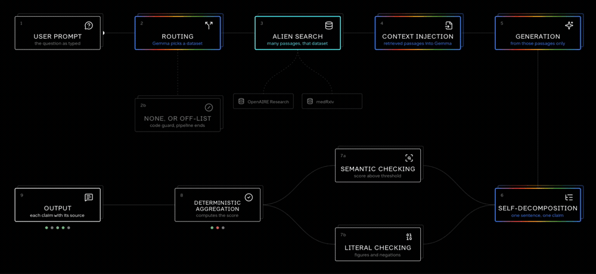

# Alien Hallucination

A local **Gemma 4** answers medical questions from research corpora served by
**Alien Intelligence**, and every sentence it writes is checked against the
passage it came from. Anything that does not hold is withheld and labelled, so
an unverified claim is never presented as a fact.

Built at the Gemma 4 Hackathon, 42 Paris, 25 July 2026, for the **Context
Engineering for SLMs** track.



*Same recording as [`docs/demo.mp4`](docs/demo.mp4) if you want it full size.*

## The pipeline

```
 1  prompt                        the user asks something
 2  routing        Gemma          picks a domain from a closed list of Alien
                                  datasets, or answers none. A code guard also
                                  rejects any answer outside the list. Either
                                  way the pipeline stops and the question is
                                  refused
 3  search         Alien          semantic search inside the chosen dataset,
                                  returning many candidate passages
 4  injection                     those passages go into Gemma's prompt, which
                                  is told to answer from them and nothing else
 5  generation     Gemma          drafts an answer from those passages
 6  decomposition  Gemma          re-reads its own answer in the same context
                                  window and cuts it into claims, one sentence
                                  each
 7a semantic check                is the claim close enough to a source
                                  passage? a score against a threshold
 7b literal check                 do its figures and negations hold against the
                                  source? deterministic, no model judgement
 8  aggregation                   valid only if both checks pass; otherwise
                                  hallucinated, or unverifiable when a check
                                  could not settle it. The verdict comes from
                                  the source, never from the model judging
                                  itself
 9  output                        the answer annotated claim by claim, each one
                                  beside the passage it was checked against,
                                  with how much context was injected
```

Gemma 4 does the work at four of those steps: it routes, it writes, it splits
its own answer, and it never gets to decide whether it was right. Alien
Intelligence supplies the corpora and the retrieval.

## Layout

```
front/    the interface: Next.js, TypeScript, no CSS or state framework
src/      the engine: routing, Alien retrieval, Gemma, verbatim checking
scripts/  command-line entry points into the engine
```

## Running the interface

```bash
make front
```

It runs on <http://localhost:3000> and works with no backend: it reports the
engine as unreachable and every question fails with a retry button. Nothing is
faked to fill the gap.

To connect the engine:

```bash
ENGINE_ORIGIN=http://localhost:8000 make front
```

`ENGINE_ORIGIN` is read server-side only. Two routes are proxied.

| Route | Method | Body | Response |
|---|---|---|---|
| `/health` | GET | — | `{ "model": "gemma-4-E4B-it" }` |
| `/ask` | POST | `{ "question": "..." }` | below |

```jsonc
{
  "draft":    "what Gemma wrote, untouched",
  "verified": "the same answer with the claims that failed removed",
  "verdict":  "grounded | partial | unsupported | refused",
  "claims": [
    {
      "id": "c1",
      "text": "one sentence",
      "status": "grounded",              // or "hallucinated" | "unverifiable"
      "semanticPass": true,              // optional, check 7a
      "literalPass": true,               // optional, check 7b
      "source": {
        "id": "...",
        "title": "shown to the user",
        "url": "https://...",            // optional
        "passage": "the matched text"    // optional
      }
    }
  ],
  "model":            "gemma-4-E4B-it",  // optional
  "dataset":          "medRxiv",         // optional, what routing chose
  "contextPassages":  24,                // optional
  "contextTokens":    3102,              // optional
  "latencyMs":        2410               // optional
}
```

`model`, `dataset`, `contextPassages`, `contextTokens` and `latencyMs` are
optional and are shown **only when the engine sends them**. The interface never
computes, estimates or defaults a number. A field that is missing is a field
that is not displayed.

Unknown fields are ignored, and a response that cannot be read at all is
reported as such rather than rendered half-way. `verdict` is derived from the
claims when absent, and a claim `status` from the two checks; if either check
is missing the claim is treated as unverifiable rather than assumed sound.

## What happens when things break

A demo has to survive a flaky laptop, so failure is a designed state.

- requests time out after 60s and are retried up to three times with jittered
  exponential backoff
- only worthwhile failures are retried: offline, unreachable, timeout, 5xx. A
  rejected question or an unreadable response is reported, not retried
- any question can be cancelled while it runs, and any failed or cancelled one
  asked again from where it sits in the conversation
- a question left running when the tab closes comes back marked cancelled
  rather than spinning forever
- a render fault shows a recoverable panel; conversations live in
  `localStorage` and survive a reload

## Credits and licences

- **Gemma 4** — Google DeepMind, Apache 2.0. Not redistributed here.
- **Alien Intelligence** — corpora and retrieval.
- **Icons** — [Lucide](https://lucide.dev), ISC, inlined in
  `front/components/icons.tsx`.
- **Dopis** — the typeface files in `front/public/fonts` are used under the
  licence they were supplied with.
- **This repository** — MIT, see `LICENSE`.

### Prior work

The verification engine in `src/` started as **Hallucide**, an open-source
project written by the same team for the Assemblée nationale hackathon earlier
in 2026. Its history is public in this repository.

Written during this hackathon: the routing over Alien datasets, the two checks
and their aggregation, the whole interface in `front/`, and the contract
between the two.
